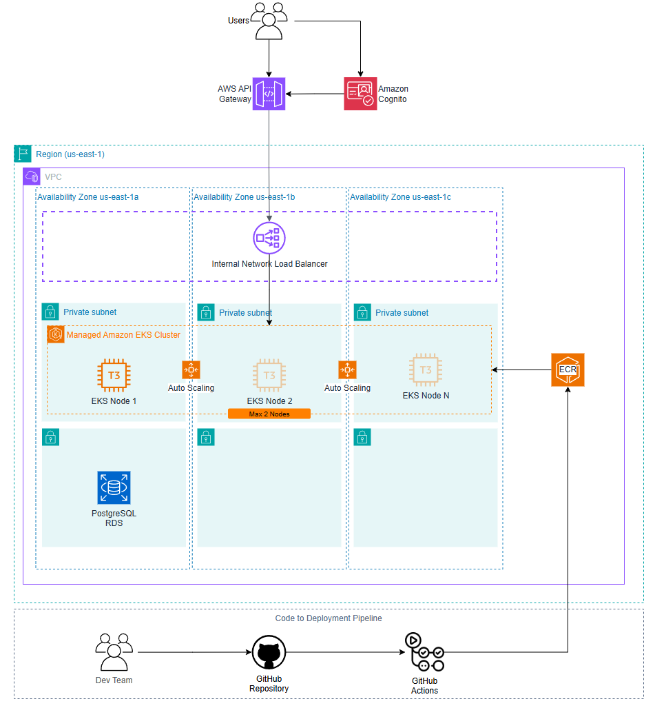

# Tech Challenge - Fase 3

A lanchonete, antes um negócio de bairro, está passando por um processo de expansão devido ao seu grande sucesso. 
No entanto, o crescimento acelerado trouxe desafios operacionais, especialmente no controle de pedidos. 
Sem um sistema digital, os pedidos eram anotados manualmente, o que gerava confusão entre os atendentes e a cozinha, 
além de atrasos e erros no atendimento.

Para resolver esse problema e garantir uma operação eficiente em escala, 
foi desenvolvida uma aplicação moderna baseada em microsserviços, 
utilizando EKS (Elastic Kubernetes Service) da AWS. 
A infraestrutura é provisionada via Terraform, 
e o processo de deploy é automatizado com GitHub Actions. 
As imagens de contêiner da aplicação são armazenadas no Amazon ECR.

---

## Arquitetura de Infraestrutura



- Os usuários acessam a aplicação por meio do **AWS API Gateway**, com autenticação gerenciada pelo **Amazon Cognito**.
- O tráfego autenticado é direcionado para um **Internal Network Load Balancer**, que distribui as requisições entre os nós do cluster.
- O cluster é composto por múltiplos nós EC2 do tipo T3, gerenciados pelo **Amazon EKS**, distribuídos em diferentes zonas de disponibilidade para garantir alta disponibilidade.
- O escalonamento dos nós é feito automaticamente com base na carga de trabalho.
- A aplicação interage com um banco de dados **PostgreSQL** hospedado no **Amazon RDS**.
- O processo de integração e entrega contínua (CI/CD) é realizado via **GitHub Actions**, que constrói a imagem da aplicação e publica no ECR.

---

## Arquitetura do Fluxo de autenticação e autorização


## Repositórios do Projeto

##### fiap-soat-tech-challenge-fase-3-infra-terraform:
https://github.com/RenatoMartinsXrd/fiap-soat-tech-challenge-fase-3-infra-terraform

##### fiap-soat-tech-challenge-fase-3-db-terraform:
https://github.com/RenatoMartinsXrd/fiap-soat-tech-challenge-fase-3-db-terraform

##### fiap-soat-tech-challenge-fase-3-lambda:
https://github.com/RenatoMartinsXrd/fiap-soat-tech-challenge-fase-3-identify-customer-lambda

##### fiap-soat-tech-challenge-fase-3-app:
https://github.com/dequevedo/fiap-soat-tech-challenge-fase-3-app

---

## Como executar este projeto

O deploy da aplicação é dividido em 4 repositórios. Cada um possui uma pipeline que roda automaticamente ao mesclar um PR na branch main. 
A execução deve seguir a ordem abaixo:

### Repositório infra-terraform
Provisiona a infraestrutura base na AWS, incluindo VPC, subnets, cluster EKS, roles e policies necessárias.

### Repositório db-terraform
Provisiona o banco de dados gerenciado (PostgreSQL via RDS) e suas configurações de acesso.

### Repositório lambda
Realiza o deploy da função Lambda responsável por identificar o cliente com base no CPF, integrada ao API Gateway e Cognito.

### Repositório app
Constrói e publica a imagem da aplicação no ECR, e realiza o deploy da aplicação no cluster EKS usando Helm.

---

### Atualizando as definições do Kubernetes manualmente

```sh
helm install fiap-tech-challenge ./infra
```

Ou, caso queira atualizar a aplicação:

```sh
helm upgrade --install fiap-tech-challenge ./infra
```

---

## Testando a aplicação

### Autenticação via AWS Cognito

Este sistema utiliza **AWS Cognito** para autenticação de usuários. O processo de login é realizado em duas etapas:

1. **Obtenção do Authorization Code**
2. **Troca do Authorization Code pelo Access Token**

#### Passo 1: Redirecionar o usuário para o Cognito

Primeiro, o usuário deve ser redirecionado para o **Cognito Login URL**, onde ele irá fornecer suas credenciais. O link de redirecionamento é o seguinte:

```
https://us-east-1gshz1lm1d.auth.us-east-1.amazoncognito.com/login?client_id=abc&response_type=token&scope=email+openid+phone&redirect_uri=https%3A%2F%2Fd84l1y8p4kdic.cloudfront.net
```

**Parâmetros explicados**:

- `client_id`: O **Client ID** da sua aplicação registrada no Cognito.
- `response_type`: O tipo de resposta esperado. No caso, estamos utilizando `token` para obter um **Access Token** diretamente.
- `scope`: Escopos solicitados para o acesso (exemplo: `email`, `openid`, `phone`).
- `redirect_uri`: A URL para a qual o usuário será redirecionado após a autenticação. O código de autorização será enviado para esta URL.

#### Passo 2: Obter o Authorization Code

Após o usuário fornecer suas credenciais no Cognito, ele será redirecionado de volta para a URL definida em `redirect_uri`. A URL de redirecionamento incluirá o **Authorization Code** como parte dos parâmetros da URL.

A URL do redirecionamento será semelhante a:

```
https://d84l1y8p4kdic.cloudfront.net?code=123abccc-98d6-1010-10d1-259b4123abcd
```

O parâmetro `code` contém o **Authorization Code** que deve ser utilizado para obter o **Access Token**.

#### Passo 3: Trocar o Authorization Code pelo Access Token

Após obter o **Authorization Code**, você deve fazer uma requisição para o endpoint `/oauth2/token` para trocar o código por um **Access Token**.

A requisição é feita via **POST** com os seguintes parâmetros:

```bash
curl --location 'https://us-east-1gshz1lm1d.auth.us-east-1.amazoncognito.com/oauth2/token' \
--header 'Content-Type: application/x-www-form-urlencoded' \
--data-urlencode 'grant_type=authorization_code' \
--data-urlencode 'client_id=1234abcde' \
--data-urlencode 'client_secret=4567efgh' \
--data-urlencode 'code=123abccc-98d6-1010-10d1-259b4123abcd' \
--data-urlencode 'redirect_uri=https://d84l1y8p4kdic.cloudfront.net'
```

**Parâmetros explicados**:

- `grant_type`: O tipo de concessão de token. Aqui, estamos utilizando `authorization_code`.
- `client_id`: O **Client ID** da sua aplicação registrada no Cognito.
- `client_secret`: O **Client Secret** associado ao seu `client_id`. (Este valor não deve ser exposto publicamente).
- `code`: O **Authorization Code** obtido na etapa anterior.
- `redirect_uri`: A URL de redirecionamento que deve coincidir com a URL fornecida na primeira etapa.

#### Resposta do Token

Se a troca for bem-sucedida, você receberá uma resposta contendo o **Access Token** e o **ID Token**. A resposta será algo assim:

```json
{
    "access_token": "ACCESS_TOKEN",
    "id_token": "ID_TOKEN",
    "expires_in": 3600,
    "token_type": "Bearer"
}
```

- **access_token**: O token de acesso que pode ser utilizado para fazer requisições autenticadas.
- **id_token**: O token de identificação, que contém informações sobre o usuário.
- **expires_in**: O tempo de expiração do token em segundos.
- **token_type**: O tipo de token, normalmente "Bearer".

#### Observações Importantes

- O **Access Token** pode ser utilizado para autenticar as requisições subsequentes no seu backend.
- O **ID Token** contém informações sobre o usuário autenticado e pode ser usado para exibir informações do perfil, se necessário.
- **Expiração**: O token expira após o tempo especificado em `expires_in`. Você precisará gerenciar a renovação de tokens utilizando um **Refresh Token** se necessário.

---
